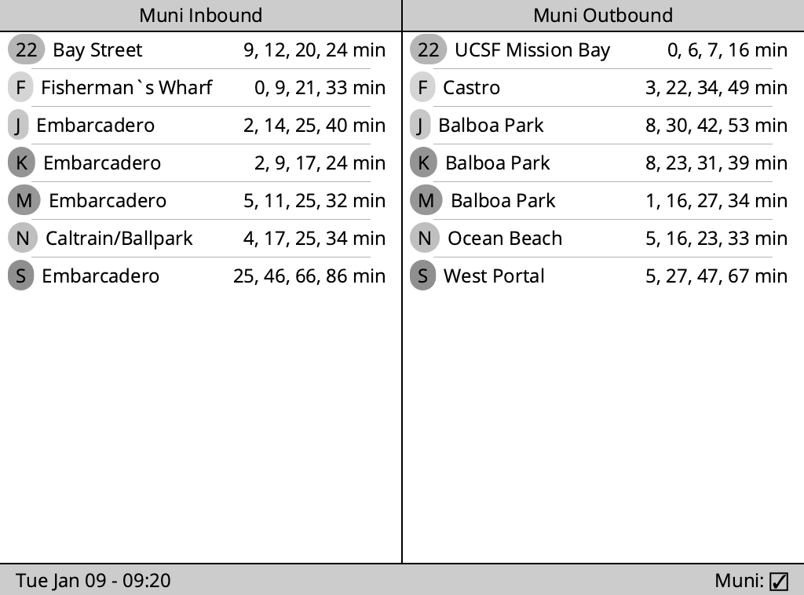

# Kindling

This is a library for making smart home displays using Rust and Kindles.

This is a Rust HTTP server which produces PNG image data that a Kindle can fetch
via `wget`, then display via `eips`. This is very experimental and should not be
considered "stable" or "good" by any definitions at present date.
